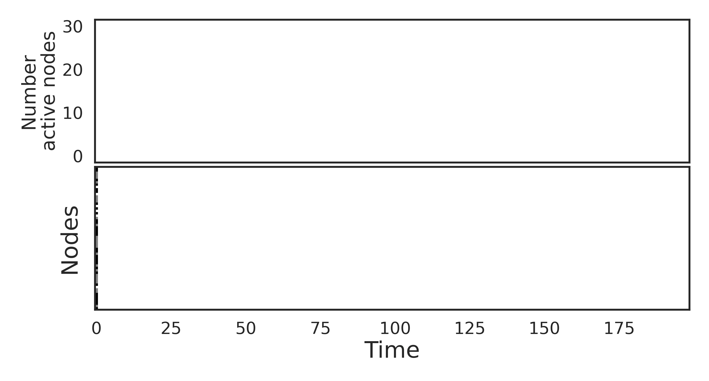

# SER model
This minimal model of spreading excitations has a rich history in many disciplines, ranging from the propagation of forest-fires, the spread of epidemics, to neuronal dynamics.
SER stands for susceptible, excited and refractory.




## Installation
```bash
pip install ser
```

## Example
```python
import matplotlib.pyplot as plt
import numpy as np
import seaborn as sns

from ser import SER

sns.set(style="white", font_scale=1.5)


# Build a random adjacency matrix (weighted and directed)
n_nodes = 50
adj_mat = np.random.uniform(low=0, high=1, size=(n_nodes, n_nodes))
adj_mat[np.random.random(adj_mat.shape) < .9] = 0  # make sparser

# Instantiate SER model once, use as many times as we want (even on different graphs)
ser_model = SER(n_steps=500,
                prop_e=.1,
                prop_s=.4,
                threshold=.4,
                prob_recovery=.2,
                prob_spont_act=.001)

# Run activity. The output is a matrix (node vs time)
activity = ser_model.run(adj_mat=adj_mat)

#Plot the activity matrix and the global activity level
activity_only_active = activity.copy()
activity_only_active[activity == -1] = 0
n_active_nodes = activity_only_active.sum(axis=0)

fig, (ax1, ax2) = plt.subplots(nrows=2, figsize=(15, 8), sharex=True)
ax1.plot(n_active_nodes, linewidth=4, color="#6D996A", alpha=.8)
ax1.set_ylabel("Number\nactive nodes", fontsize=25)
ax2.imshow(activity, cmap="binary_r")
ax2.set_xlabel("Time", fontsize=25)
ax2.set_ylabel("Nodes", fontsize=25)
ax2.set_aspect("auto")
ax2.grid(False)
sns.despine()
fig.tight_layout()
```


## Requirements
 - numpy
 - numba==0.49.1 or 0.51.2 (other versions might work, but these are the one I tested so far).

Tested in Ubuntu 18.05 with Python 3.8.5.

## Implementation
The graph (or network) is represented as an adjacency matrix (numpy array).
Dynamics is implemented on numba, so it is fast - quick benchmarks show between 2-3 times faster simulations than pure vectorized numpy versions!

## Numba tips and tricks
- Don't use adj_mat with type other than np.float32, np.float64.
- Pro-tip: use np.float32 for adj_mat – it will run faster.

## Limitations
- The graph is represented as a numpy array, which is less memory efficient than a list or a dictionary representation.
That limits the size of the network you can use (of course, depending on your RAM).

## References
  - J. M. Greenberg and S. P. Hastings, SIAM J. Appl. Math. 34, 515 (1978).
  - A. Haimovici et al. Phys. Rev. Lett. 110, 178101 (2013).
  - Messé et al. PLoS computational biology (2018)

### TODO
  - Tests
  - Examples
  - Implement multi runs
  - Optional turn off numba
  - networkx and igraph conversions
